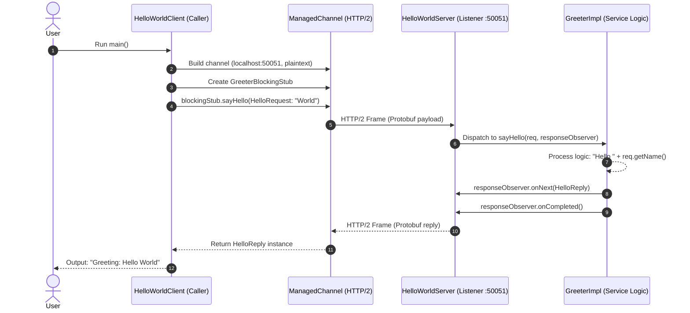

# Lab 7: Introduction to gRPC and Protocol Buffers in Java

## 1. Overview and Purpose

This lab explores **Remote Procedure Calls (RPC)** using **gRPC** and **Protocol Buffers (Protobuf)** in Java.

### What is gRPC?
**gRPC** (Google Remote Procedure Call) is a modern, open-source, high-performance RPC framework. It allows a client application to directly invoke methods on a server application hosted on a different machine (or process) as if it were a local object call.

Key characteristics of gRPC:
- **Language & Platform Agnostic:** Service interfaces can be defined once and compiled into multiple programming languages (Java, C++, Python, Go, etc.).
- **Transport Layer:** Runs on top of **HTTP/2**, taking advantage of bidirectional streaming, multiplexing (multiple requests/responses over a single TCP connection), header compression (HPACK), and reduced latency.
- **Contract-First Design:** Client and server communicate strictly according to an agreed interface defined in an Interface Definition Language (IDL), specifically Protocol Buffers.

### What are Protocol Buffers?
**Protocol Buffers (Protobuf)** serve two key roles:
1. **Interface Definition Language (IDL):** Defines the structure of the messages and the signature of remote services in `.proto` files.
2. **Serialization Format:** A language-neutral, platform-neutral binary format for serializing structured data. It is significantly smaller, faster, and more bandwidth-efficient than JSON or XML.

---

## 2. Project Architecture and Components

The lab is structured into three primary components:

```
Lab 7/
├── pom.xml                                      # Maven build file with plugins & dependencies
├── src/main/proto/
│   └── helloworld.proto                         # Service contract & message schemas (Protobuf)
└── src/main/java/com/example/grpc/
    ├── HelloWorldServer.java                    # gRPC Server implementation
    └── HelloWorldClient.java                    # gRPC Client implementation
```



---

## 3. Detailed Walkthrough of Components

### 1. Service & Message Definition (`helloworld.proto`)
Located in `src/main/proto/helloworld.proto`:

```protobuf
syntax = "proto3";

option java_multiple_files = true;
option java_package = "com.example.grpc";
option java_outer_classname = "HelloWorldProto";

service Greeter {
  rpc SayHello (HelloRequest) returns (HelloReply) {}
}

message HelloRequest {
  string name = 1;
}

message HelloReply {
  string message = 1;
}
```

- **`syntax = "proto3"`**: Declares the usage of Protocol Buffers version 3.
- **Java Options**:
  - `java_multiple_files = true`: Generates top-level Java classes for each message and service class instead of wrapping them inside a single outer class.
  - `java_package`: Specifies the Java package for generated classes (`com.example.grpc`).
- **`service Greeter`**: Defines the RPC interface. The method `SayHello` takes a `HelloRequest` and returns a `HelloReply`.
- **Field Numbers (`= 1`)**: Unique field tags used in binary encoding to identify fields instead of transmitting full string field names.

---

### 2. Maven Build Configuration (`pom.xml`)
The `pom.xml` automates code generation via the `protobuf-maven-plugin`:

- **Dependencies**:
  - `grpc-netty-shaded`: The underlying HTTP/2 transport engine (Netty bundled with shaded dependencies to prevent classpath conflicts).
  - `grpc-protobuf`: Utilities integrating gRPC with Protocol Buffers.
  - `grpc-stub`: Runtime libraries providing client stubs (Blocking, Async, Future) and server-side base classes.
  - `protobuf-java`: Core Protobuf serialization engine.
- **Plugins**:
  - `os-maven-plugin`: Detects current OS and architecture (e.g., `windows-x86_64`) to download the matching native binary compiler.
  - `protobuf-maven-plugin`:
    - `protocArtifact`: Compiles `.proto` message definitions into Java message classes (`HelloRequest`, `HelloReply`).
    - `pluginArtifact` (`protoc-gen-grpc-java`): Generates gRPC service code (`GreeterGrpc`, `GreeterImplBase`, `GreeterBlockingStub`).

---

### 3. Server Implementation (`HelloWorldServer.java`)
Located in `src/main/java/com/example/grpc/HelloWorldServer.java`:

#### Core Responsibilities:
1. **Service Logic (`GreeterImpl`)**:
   - Extends the generated base class `GreeterGrpc.GreeterImplBase`.
   - Overrides `sayHello(HelloRequest req, StreamObserver<HelloReply> responseObserver)`:
     ```java
     HelloReply reply = HelloReply.newBuilder()
             .setMessage("Hello " + req.getName())
             .build();
     responseObserver.onNext(reply);
     responseObserver.onCompleted();
     ```
   - **`StreamObserver`**: Asynchronous callback interface used in gRPC.
     - `onNext(value)`: Sends response back to the client.
     - `onCompleted()`: Signals that the RPC call is complete.

2. **Server Lifecycle Management**:
   - Binds to port `50051`:
     ```java
     server = ServerBuilder.forPort(50051)
             .addService(new GreeterImpl())
             .build()
             .start();
     ```
   - Registers a **JVM Shutdown Hook** to gracefully shut down the server and terminate active requests if the process is stopped.
   - `blockUntilShutdown()`: Keeps the main thread blocked (`server.awaitTermination()`) so the server remains active and listening.

---

### 4. Client Implementation (`HelloWorldClient.java`)
Located in `src/main/java/com/example/grpc/HelloWorldClient.java`:

#### Core Responsibilities:
1. **Channel Creation**:
   - Establishes a virtual connection to the server:
     ```java
     ManagedChannel channel = Grpc.newChannelBuilder("localhost:50051", InsecureChannelCredentials.create())
             .build();
     ```
   - `InsecureChannelCredentials.create()`: Configures plaintext HTTP/2 without TLS (suitable for local testing).
   - `ManagedChannel`: Manages connection lifecycles, pooling, reconnection, and keep-alive.

2. **Stub Usage**:
   - Stubs wrap client-side RPC calls to look like local method calls:
     ```java
     blockingStub = GreeterGrpc.newBlockingStub(channel);
     ```
   - **Blocking Stub**: The caller thread synchronously waits until the server responds or throws a `StatusRuntimeException`.

3. **RPC Execution**:
   - Constructs request using the Builder pattern:
     ```java
     HelloRequest request = HelloRequest.newBuilder().setName("World").build();
     HelloReply response = blockingStub.sayHello(request);
     System.out.println("Greeting: " + response.getMessage());
     ```

4. **Resource Teardown**:
   - The `finally` block ensures `channel.shutdownNow().awaitTermination(...)` is invoked to prevent connection and thread leaks.

---

## 4. Execution Lifecycle & Step-by-Step Flow

1. **Compilation Phase**:
   Running `mvn compile` parses `helloworld.proto` and creates:
   - Message classes: `HelloRequest.java`, `HelloReply.java`
   - Service classes: `GreeterGrpc.java` (containing stubs and service base classes)

2. **Server Execution**:
   - When `HelloWorldServer.main()` runs, Netty opens port `50051`.
   - The server waits for incoming HTTP/2 connections.

3. **Client Call**:
   - When `HelloWorldClient.main()` runs, it establishes an HTTP/2 channel to `localhost:50051`.
   - It serializes `HelloRequest` into Protobuf binary format.
   - It issues an HTTP/2 `POST` request to path `/com.example.grpc.Greeter/SayHello`.

4. **Server Processing & Reply**:
   - The server unmarshals the incoming binary payload into a `HelloRequest` object.
   - Dispatches call to `GreeterImpl.sayHello`.
   - Constructs `HelloReply` ("Hello World"), serializes it to binary, and sends it back.

5. **Client Response & Output**:
   - The client deserializes the reply and logs:
     ```
     Greeting: Hello World
     ```
   - The channel is closed cleanly.

---

## 5. Comparison: gRPC vs Traditional REST (HTTP/1.1 + JSON)

| Feature | gRPC | REST (Typical) |
| :--- | :--- | :--- |
| **Protocol** | HTTP/2 (Multiplexed streams) | HTTP/1.1 or HTTP/2 |
| **Payload Format** | Binary (Protocol Buffers) | Text (JSON, XML) |
| **Contract** | Strict, type-safe schema (`.proto`) | Optional / Loosely coupled (OpenAPI) |
| **Performance** | High throughput, low latency, low bandwidth | Moderate (parsing overhead of JSON) |
| **Streaming** | Bidirectional, client-side, server-side | Typically request-response (SSE/WebSockets needed for stream) |
| **Code Generation** | Native tooling across languages | Often requires third-party plugins |
